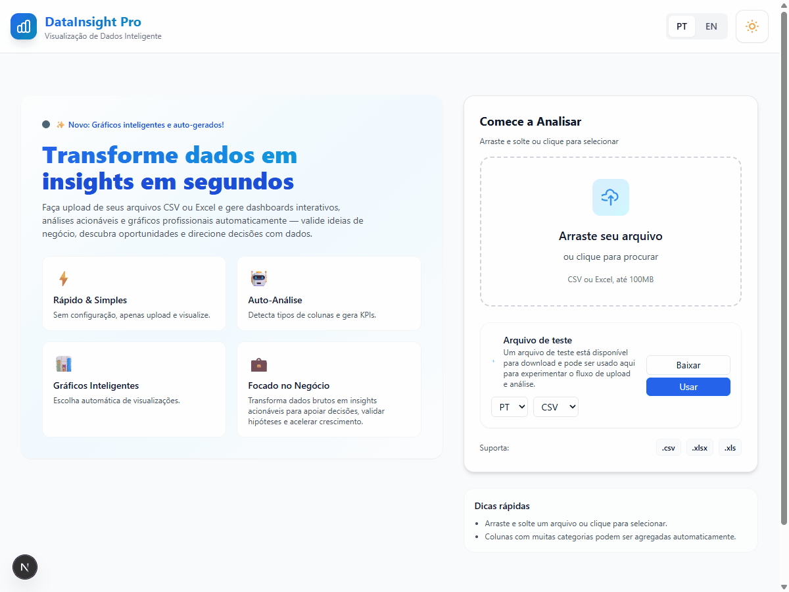

This is a [Next.js](https://nextjs.org) project bootstrapped with [`create-next-app`](https://nextjs.org/docs/app/api-reference/cli/create-next-app).

## Getting Started

First, run the development server:

```bash
npm run dev
# or
yarn dev
# or
pnpm dev
# or
bun dev
```

Open the address shown in your terminal after starting the dev server to view the app.

You can start editing the page by modifying `app/page.tsx`. The page auto-updates as you edit the file.

This project uses [`next/font`](https://nextjs.org/docs/app/building-your-application/optimizing/fonts) to automatically optimize and load [Geist](https://vercel.com/font), a new font family for Vercel.

## Test data

This project includes sample test files you can use to try the upload and analysis flow locally.

- Location: `test-data/`
- Portuguese files: `test_data_pt.csv`, `test_data_pt.xlsx`, `test_data_pt.xls`
- English files: `test_data_en.csv`, `test_data_en.xlsx`, `test_data_en.xls`

# Processing and Data View

A small Next.js + React + TypeScript app to upload, explore and visualize tabular test data. The project includes Portuguese and English sample data and a compact UI for switching languages, uploading files, and exploring columns and charts.



## Features

- Language switching (Portuguese / English) with a reactive client provider.
- Upload or use included test datasets to populate the dashboard.
- Interactive charts (Recharts) and a data table with search and sorting.
- Column explorer to toggle visibility and inspect column statistics.

## Tech Stack

- Next.js (App Router)
- React + TypeScript
- Tailwind CSS for styles
- Recharts for charts
- SheetJS (`xlsx`) for spreadsheet parsing

## Getting Started

1. Install dependencies:

```bash
npm install
```

2. Run the development server:

```bash
npm run dev
```

3. Open the address shown in your terminal after starting the dev server to view the app.

Note: This README does not reference any fixed local URLs; see your terminal output for the actual running address.

## Test Data

- Sample files are stored in the `test-data/` directory and follow this naming convention:
  - `test_data_pt.csv`, `test_data_pt.xlsx`, `test_data_pt.xls` (Portuguese)
  - `test_data_en.csv`, `test_data_en.xlsx`, `test_data_en.xls` (English)

- From the Home page you can either download the files or click "Use" to load a sample dataset directly into the app.

## Demo GIF

- A demo GIF generated during development is included at `public/demo-walkthrough.gif`. It is referenced above and will render on GitHub when viewing this repository.

## Project Structure (key files)

- `app/` — Next.js App Router pages and API routes
- `src/components/` — UI components such as `FileUpload`, `Dashboard`, `TestDataControls`, `ColumnExplorer`, and `SmartCharts`
- `src/lib/parseFile.ts` — file parsing helpers using `xlsx`
- `src/lib/i18n/` — translations and the language provider hook

## Notes & Recommendations

- The project uses Recharts; charts are guarded against missing dimensions but visual QA across screen sizes is recommended.
- If you want to replace the demo GIF later, add a `public/demo-walkthrough.gif` file or update the README image path accordingly.

---

If you want, I can also create a short CONTRIBUTING or DEPLOYMENT section next (for GitHub Pages or Vercel). Let me know which you prefer.

---

## Project overview

This repository is a small Next.js app (App Router) for exploring tabular datasets: upload CSV/XLS(X), automatic column detection, quick insights, and auto-generated charts. It includes a small demo UI, language switching (PT/EN), and a test-data feature to try the flow quickly.

## Prerequisites

- Node.js (18+ recommended)
- npm (or yarn/pnpm)

## Setup

1. Install dependencies:

```bash
npm install
# or yarn
```

2. Start the dev server:

```bash
npm run dev
```

3. Open the address shown in your terminal after starting the server to view the app.

## Usage

- Upload a CSV/XLS(X) file using the upload card on the right.
- Or use the "Arquivo de teste" card to download or immediately load one of the supplied demo files (`test_data_pt.*` or `test_data_en.*`).
- After loading data the app shows a simple dashboard with insights, column explorer and auto-generated charts.

## Test files

- Files are stored in `test-data/` and follow the naming:
  - `test_data_pt.csv, .xlsx, .xls` (Portuguese)
  - `test_data_en.csv, .xlsx, .xls` (English)

## Demo GIF

- A demo GIF is included at `public/demo-walkthrough.gif` if present. The project does not include any automated capture or assembly scripts.

## Troubleshooting

- If the dev server cannot start because port 3000 is in use, either stop the process using that port or run `PORT=3001 npm run dev` to pick another port.
- If the test-data downloads fail, confirm the files exist under `test-data/` and that the dev server is running (the API route `/api/test-data` serves them).

## Contributing

Small improvements welcome: file parsers, more robust type detection, more chart types, and better i18n coverage.
